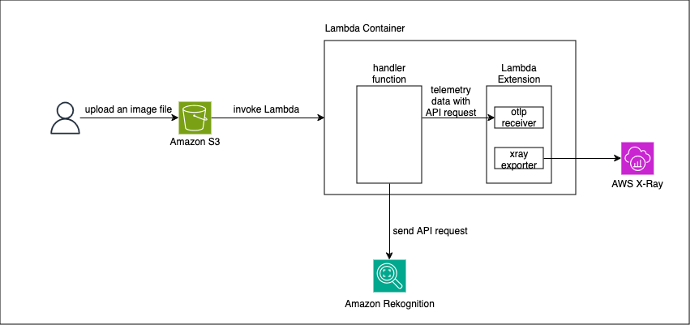

# Send Traces to AWS X-Ray Using OpenTelemetry SDK from Containerized Lambda

This repository showcases how to send traces to AWS X-Ray using the OpenTelemetry SDK from a containerized AWS Lambda function. The project demonstrates the integration of OpenTelemetry Collector as a Lambda extension, which collects and exports trace data to AWS X-Ray.



## Build OpenTelemetry Collector

The OpenTelemetry Collector is responsible for collecting and exporting trace data from the Lambda function to AWS X-Ray. In this section, we'll build the custom Collector image with the necessary configuration and components.

```
git clone https://github.com/aws-samples/opentelemetry-lambda-container.git
cd opentelemetry-lambda-container
git clone https://github.com/open-telemetry/opentelemetry-lambda.git -b layer-collector/0.4.0
cp -r opentelemetry-lambda/collector/ otel-collector-lambda-extension
rm -rf opentelemetry-lambda/
```

### Edit Files
In this step, we'll modify the OpenTelemetry Collector configuration to include the AWS X-Ray exporter. This allows the Collector to send trace data to the AWS X-Ray service.

1. Edit the `otel-collector-lambda-extension/lambdacomponents/go.mod` file to add the `awsxrayexporter` dependency.

```
require (
    github.com/open-telemetry/opentelemetry-collector-contrib/exporter/prometheusremotewriteexporter v0.92.0
    // add awsxrayexporter
	github.com/open-telemetry/opentelemetry-collector-contrib/exporter/awsxrayexporter v0.92.0
)
```
2. Edit the `otel-collector-lambda-extension/lambdacomponents/default.go` file to import the `awsxrayexporter` and add it to the list of exporters.

```go
import (
    // import awsxrayexporter
    "github.com/open-telemetry/opentelemetry-collector-contrib/exporter/awsxrayexporter"
)

func Components(extensionID string) (otelcol.Factories, error) {
	exporters, err := exporter.MakeFactoryMap(
        // add awsxrayexporter
		awsxrayexporter.NewFactory(),
		loggingexporter.NewFactory(),
		otlpexporter.NewFactory(),
		otlphttpexporter.NewFactory(),
		prometheusremotewriteexporter.NewFactory(),
	)

	return factories, multierr.Combine(errs...)
}
```

3. Add Dockerfile in `otel-collector-lambda-extension/Dockerfile` to build the OpenTelemetry Collector.

```dockerfile
FROM public.ecr.aws/docker/library/golang:1.20 as collector-builder
WORKDIR /src
COPY . .
RUN go mod tidy
RUN GO111MODULE=on CGO_ENABLED=0 installsuffix=cgo go build -trimpath -o collector .

FROM scratch
COPY --from=collector-builder /src/collector src/collector
```

### Push Collector to ECR
After building the OpenTelemetry Collector image, we need to push it to an Amazon Elastic Container Registry (ECR) repository. This allows the Lambda function to use the Collector as a Lambda extension.

The steps in this section demonstrate how to create an ECR repository, log in to the registry, and push the Collector image to the repository.

```
export AWS_ACCOUNT_ID=$(aws sts get-caller-identity --query Account --output text)
cd otel-collector-lambda-extension
aws ecr create-repository --repository-name lambda-extension/otel-collector
aws ecr get-login-password --region us-east-1 | docker login --username AWS --password-stdin ${AWS_ACCOUNT_ID}.dkr.ecr.us-east-1.amazonaws.com
docker build -t lambda-extension/otel-collector .
docker tag lambda-extension/otel-collector:latest ${AWS_ACCOUNT_ID}.dkr.ecr.us-east-1.amazonaws.com/lambda-extension/otel-collector:v1
docker push ${AWS_ACCOUNT_ID}.dkr.ecr.us-east-1.amazonaws.com/lambda-extension/otel-collector:v1
```

## Deploy Lambda with CDK
In this section, we'll use the AWS CDK (Cloud Development Kit) to deploy the Lambda function that will be instrumented with the OpenTelemetry SDK and use the OpenTelemetry Collector as a Lambda extension.

The Lambda function is triggered by an image being uploaded to an S3 bucket. The `RekognitionSourceBucketName` output provides the name of the S3 bucket that you can use to test the Lambda function and observe the trace data in AWS X-Ray.

### Edit Dockerfile of the Lambda function
Replace `<Your AWS account id>` in `lambda-function/Dockerfile`.

### Deploy
Run the following commands.

```
cd lambda-trace
npm install
cdk deploy
```

### Check the Lambda Function Works
Run the following command to put an image to a S3 bucket.

```
aws s3api put-object --bucket <RekognitionSourceBucketName> --key image.png --body <Some image file>
```

Then visit the AWS X-Ray console and you find trace data.


## Clean Up
After testing the solution, you can use the provided commands to clean up the resources, including the deployed Lambda function and the ECR repository for the OpenTelemetry Collector image.

```
cdk destroy
aws ecr batch-delete-image --repository-name lambda-extension/otel-collector --image-ids imageTag=v1
aws ecr delete-repository --repository-name lambda-extension/otel-collector
```

## Security

See [CONTRIBUTING](CONTRIBUTING.md#security-issue-notifications) for more information.

## License

This library is licensed under the MIT-0 License. See the LICENSE file.

